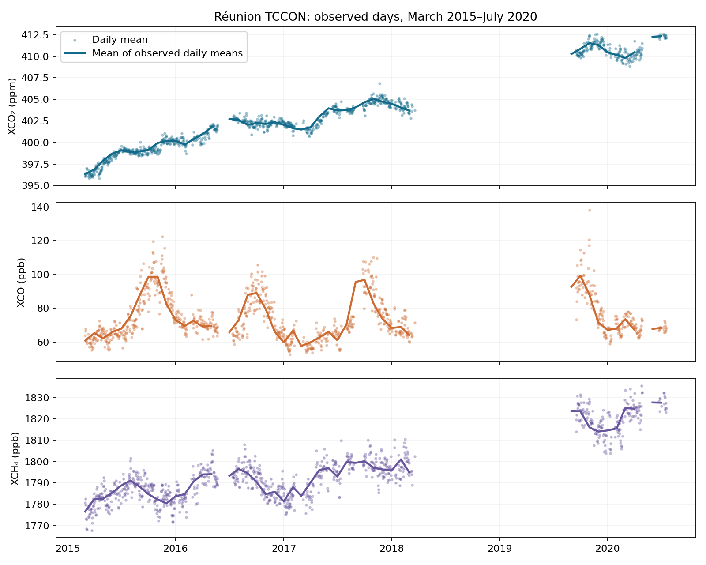

# Réunion TCCON atmospheric time series

**Miranda Nkwikah Finjap** · Independent reproducible portfolio study · October 2026

Analyse actual ground-based gas observations with explicit unit handling, daily aggregation, coverage reporting and a focused CO/CO2 co-variation study.

## Run

Use Python 3.11 or newer. From this repository directory:

```bash
python -m venv .venv
source .venv/bin/activate
pip install -r requirements.txt
python analysis.py
python -m unittest discover -s tests -v
```

Windows activation: `.venv\Scripts\activate`. Data required for the main analysis
are bundled, so the analysis runs without downloading large files.

Open [notebook.ipynb](notebook.ipynb) in Jupyter or Google Colab to read the executed
walkthrough. When using Colab, upload/extract the entire repository and change to
its directory before running the notebook. `analysis.py` is the runnable source.

## Evidence and outputs

See [results/metrics.json](results/metrics.json) for measured results, `results/`
for figures and CSV outputs, and [data/PROVENANCE.md](data/PROVENANCE.md) for
sources, units and the distinction between observations and demonstrations.
Tests target scientific failure modes, rather than merely checking that files exist.

## Findings from the completed run

121,651 quality-controlled observations were summarised into 953 observed days. The 20 September–5 October 2019 daily CO–CO2 correlation is **r = 0.114** across 16 days. This is weak linear association and does not establish a biomass-burning plume.



## Scope and limitations

No FLEXPART transport attribution, CAMS validation or raw-spectra retrieval is claimed. Daily/monthly summaries do not correct clear-sky or seasonal sampling bias.

Climate/health relevance: greenhouse-gas monitoring and emissions analysis provide
climate context; none of these quantities directly estimates a person's exposure,
disease risk or health outcome.

## Research ownership and review

This analysis was prepared collaboratively with coding assistance. All original
observations and published results remain credited to their data providers.
The researcher should reproduce the run, inspect the figures and understand the
methods before presenting the work or extending it for publication.
This repository is a portfolio study, not a peer-reviewed article.

Contact: miranda.finjap@aims-cameroon.org
